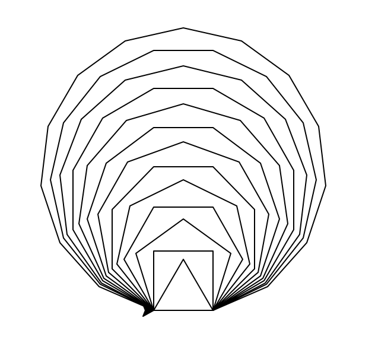
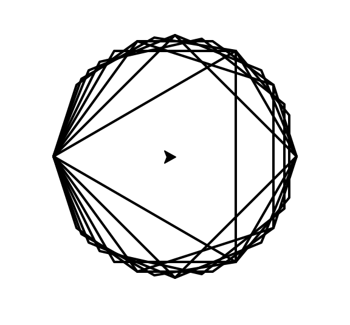

0] Pri kreslení korytnačky nezabudni importovať knižnicu
`import turtle`
prípadne pre skrátený zápis:
`import turtle as t`
aby si mohol korytnačku používať a kresliť jej perom, keď sa hýbeš po grafickej ploche

1] Nakresli 6-uholník pomocou korytnačky.

2] Vyskúšaj nakresliť špirálu, pozoruj, zamýšľaj sa nad uhlami a have fun!

```
t.bgcolor('black')
t.speed(0)

for x in range(360):
    farba = 'white'
    zv = x % 6
    if zv == 0:
        farba = 'red'
    elif zv == 1:
        farba = 'purple'
    elif zv == 2:
        farba = 'blue'
    elif zv == 3:
        farba = 'green'
    elif zv == 4:
        farba = 'orange'
    elif zv == 5:
        farba = 'yellow'

    t.pencolor(farba)
    t.forward(x)
    t.left(59)
```

3] Ako sa obrázok zmení, keď v každom kroku postupne zväčšuješ hrúbku pera?
Pridaj napr. príkaz:

```
t.pensize(x/100 + 1)
```

Vyskúšaj aj iné varianty (trošku iný uhol, iná dĺžka, iná hrúbka, ...)...

4] Vyskúšaj špirálu slimák

```
for i in range(100):
    t.fd(i*2)
    t.lt(360 / 10)
```

5] Vyskúšaj štvorcovú verziu slimáka

```
for a in range(100):
    t.fd(a*4)
    t.lt(360 / 4)
```

6] Čím viac n-uholníková špirála, tým okrúhlejšia:

```
for i in range(100):
    t.fd(10 + i)
    t.lt(360 / 20)
```

7] Viackrát spusti program s náhodnými špirálami:

```
uhol = random.randint(30, 170)
print('spirala s uhlom', uhol)
for i in range(3, 300, 3):
    t.fd(i)
    t.rt(uhol)
```

8] Pritvrdíme, vyskúšaj mind blowing špirálu:

```
for uhol in range(1, 3000):
    t.fd(8)
    t.rt(uhol)
```

9] Vyskúšaj rôzne zmeny uhla:

```
t.rt(uhol+0.1)
```

10]

```
t.rt(uhol+0.333)
```

11] Naprogramujme korytnačku, ktorá bude chodiť náhodne v kruhu.

```
t.pensize(5)
t.pencolor('red')
for i in range(10000):
    t.setheading(random.randint(0, 359))
    t.fd(10)
    if t.xcor()**2 + t.ycor()**2 > 50**2:
        t.fd(-10)
```

12] Metóda `distance()` vypočíta vzdialenosť korytnačky od nejakého bodu.
Naprogramujme korytnačku, nech sa náhodne prechádza po ploche a podľa vzdialenosti od vybraného bodu jej šikovne zmeníme farbu.

```
t.bgcolor('navy')
t.pensize(5)
t.pencolor('yellow')
for i in range(10000):
    t.seth(random.randint(0, 359))
    t.fd(10)
    if t.distance(40, 0) > 100 or t.distance(100, 0) < 100:
        t.fd(-10)
```

13] Vieš naprogramovať štvorec v strede grafickej plochy pomocou náhodných prechádzok?

14] Nakresli obrázok, kde je viac n-uholníkov naraz s rovnakou stranou


15] Nakresli obrázok, kde je viac n-uholníkov naraz, sú opísané kružnici s rovnakým polomerom

